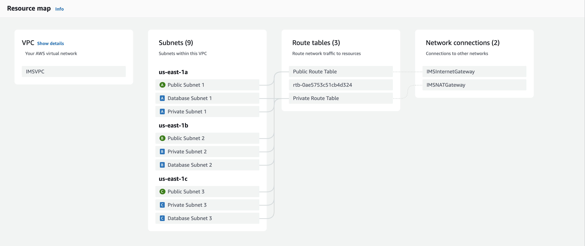

<div align="center">
  
  <h1>
    IMS
  </h1>
  <p>
    Open source Inventory Management System for clothing business👗
  </p>
  
  <h4>
    <a href="https://demoims.com">View Demo</a>
	</h4>
</div>

## 🌟 About the Project

IMS is an open-source Inventory Management System which provides powerful features for stock control, customer management and order placement, deployed on highly available AWS services. The system is built on a Python/Django-based database backend, coupled with an interactive React-based frontend, providing an intuitive interface for shop managers to efficiently manage operations.


### 👾 Tech Stack

<details>
  <summary>Frontend</summary>
  <ul style="font-size:14px">
    <li>React</li>
    <li>React Router</li>
    <li>Tailwind css</li>
  </ul>
</details>

<details>
  <summary>Backend</summary>
  <ul style="font-size:14px">
    <li>Python</li>
    <li>pytest</li>
    <li>Django</li>
    <li>JWT</li>
  </ul>
</details>

<details>
  <summary>Database</summary>
  <ul style="font-size:14px">
    <li>Postgres</li>
    <li>SQLite</li>
  </ul>
</details>

<details>
  <summary>DevOps</summary>
  <ul style="font-size:14px">
    <li>Docker</li>
    <li>Terraform</li>
  </ul>
</details>

<details>
  <summary>AWS</summary>
  <ul style="font-size:14px">
    <li>VPC</li>
    <li>NAT Gateway</li>
    <li>Internet Gateway</li>
    <li>Application Load Balancer</li>
    <li>RDS</li>
    <li>S3</li>
    <li>ECS Fargate</li>
    <li>Auto Scaling</li>
    <li>ECR</li>
    <li>ACM</li>
    <li>Route 53</li>
    <li>CloudFront</li>
  </ul>
</details>


<h3>🔒 Demo Account</h3>

**Account:** Admin

**Password:**  123456


<h3>✅ To be implemented</h3>

<div>
  <label>
    Add stock by using scanner
  </label>
  <br />
  <label>
    Forget password (AWS Lambda)
  </label>
  <br />
  <label>
    Stock info autofilling (ML)
  </label>
</div>


## Architecture


## Getting Started

### Local Deployment

Before starting the deployment, ensure that [Docker](https://www.docker.com/) is installed on your system.


To start your local deployment, run the following line:

```bash
docker compose up --build
```

Now, you can access IMS system via [http://localhost:5173/]() !


To stop your local deployment, simply run the following line:

```bash
docker compose down
```


### AWS Deployment

Before starting the deployment, ensure that [Terraform](https://www.terraform.io/) is installed on your system.


To configure AWS credentials used by Terraform, navigate to the `/terraform/provider.tf` file and **update** the following line:

```Terraform
provider "aws" {
  ...
  profile = "iamadmin-test" # UPDATE as your AWS profile name
}
```

or, **delete** this line to use default configuration.


Additionally, to certify your two domains (frontend and backend) via AWS Certificate Manager, create a new file named `variables.tf` under the `/terraform` folder. Add the following lines to the file, replacing the placeholders with your values.

```Terraform
variable "backend_domain_name" {
  type    = string
  default = "..." # e.g. demoims-backend.com
}

variable "acm_certificate_backend_arn" {
  type    = string
  default = "..."
}

variable "route53_zone_backend_id" {
  type    = string
  default = "..."
}

variable "frontend_domain_name" {
  type    = string
  default = "..." # e.g. demoims.com
}

variable "acm_certificate_frontend_arn" {
  type    = string
  default = "..."
}

variable "route53_zone_frontend_id" {
  type    = string
  default = "..."
}
```


Now, you can start your deployment, run the following line:

```bash
terraform init
terraform apply
```


and, run the following command to destroy your deployment:

```bash
terraform destroy
```


## Screenshots

Dashboard page


Customer page


Product details page


VPC Deployment by Terraform




RDS Deployment by Terraform


ECS Deployment by Terraform


ECS Task Deployment by Terraform


CloudFront Deployment by Terraform


Route 53 Deployment by Terraform


